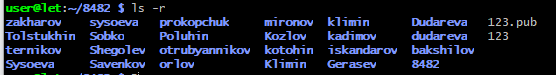
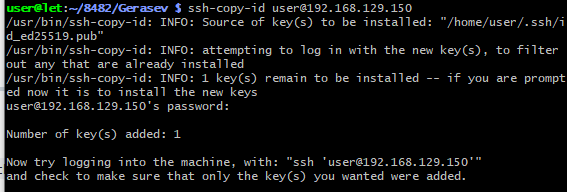

Пользователь просит переписать текст, изменив формулировку и оформление, убрав эмодзи, но сохраняя главную суть. Это не требует использования инструментов поиска, это просто задача на переформатирование и переписывание текста.

Я должен:
1. Убрать все эмодзи (📋, 🔹, 📷, 🔒, 🔓, 💡, ✅)
2. Переформулировать текст, изменив способ изложения
3. Сохранить всю важную информацию и суть
4. Оставить структуру примерно такой же или улучшить её
5. Убрать лишние графические элементы типа стрелок

Я переделаю текст, используя более формальный или иной стиль, переформулирую заголовки и описания, но сохраню все команды и информацию.# Лабораторная работа: Подключение к Raspberry Pi через SSH

## Цель работы

Приобрести навыки подключения к одноплатному компьютеру Raspberry Pi посредством протокола SSH с использованием аутентификации по паролю и по ключам. Научиться выполнять базовые операции с файловой системой удалённого устройства.

---

## ЧАСТЬ 1. Подключение с использованием пароля и работа с файловой системой

### Установка SSH-соединения

Для подключения к Raspberry Pi введите в терминал следующую команду:

```bash
ssh user@192.168.129.150
```

### Создание каталогов и файлов

Выполните следующую последовательность действий:

1. Перейдите в корневой каталог и откройте папку, соответствующую номеру вашей группы
2. В этом каталоге создайте папку с вашей фамилией
3. Выполните требуемое по методическим указаниям задание на создание вложенных каталогов и файлов согласно вашему варианту

Примеры используемых команд:

```bash
cd /
cd путь_к_папке_группы
mkdir Фамилия
cd Фамилия
```

### Проверка структуры и завершение сессии

Для вывода полной структуры созданных каталогов и файлов в рекурсивном формате используйте команду:

```bash
ls -R
```



Для закрытия SSH-соединения и завершения работы выполните:

```bash
exit
```

---

## ЧАСТЬ 2. Настройка аутентификации по SSH-ключам

### Проверка наличия существующих ключей

На вашем локальном компьютере проверьте содержимое директории `.ssh`:

```bash
ls ~/.ssh
```

Если в выводе присутствуют файлы `id_rsa.pub` или `id_dsa.pub`, это означает, что ключи уже созданы, и вы можете перейти к следующему этапу.

### Генерация новой пары SSH-ключей

В случае отсутствия ключей выполните:

```bash
ssh-keygen
```

При выполнении команды:
- На запрос пути сохранения файла нажмите Enter (будет использован путь по умолчанию: ~/.ssh/)
- На запрос пароля для защиты приватного ключа нажмите Enter, оставив поле пустым

После создания проверьте результат:

```bash
ls ~/.ssh
```

В результате должны появиться два файла:
- `id_rsa` — приватный ключ, который хранится на локальном компьютере
- `id_rsa.pub` — публичный ключ, который будет скопирован на Raspberry Pi

### Копирование публичного ключа на Raspberry Pi

Для добавления вашего публичного ключа на плату используйте команду:

```bash
ssh-copy-id user@192.168.129.150
```

При первом подключении система запросит пароль пользователя (по умолчанию: 123).



---

## Ответы на контрольные вопросы

### 1. Что представляет собой командная строка?

Командная строка (интерфейс командной строки, CLI) — это текстовый режим взаимодействия пользователя с операционной системой, при котором команды вводятся вручную и обрабатываются интерпретатором (bash, cmd, PowerShell). Такой интерфейс позволяет управлять операционной системой и выполнять различные операции без использования графического интерфейса.

### 2. Основные команды для работы с файлами и каталогами

| Операция | Linux/Unix | Windows |
|----------|-----------|---------|
| Отображение содержимого папки | `ls [-la]` | `dir` |
| Переход в каталог | `cd путь` | `cd путь` |
| Создание папки | `mkdir имя` | `mkdir имя` |
| Удаление файла | `rm файл` | `del файл` |
| Удаление папки | `rm -r папка` | `rmdir /s папка` |
| Копирование файла | `cp от куда куда` | `copy от куда куда` |
| Перемещение файла | `mv от куда куда` | `move от куда куда` |
| Просмотр содержимого файла | `cat файл` | `type файл` |

### 3. Команды для получения информации о системе

Для операционной системы Linux применяются следующие команды:

```bash
uname -a      # Информация о версии ядра
hostname      # Имя хоста
whoami        # Текущий пользователь
free -h       # Объём используемой оперативной памяти
df -h         # Информация о занимаемом месте на диске
ps aux        # Список активных процессов
ip a          # Сетевые интерфейсы и адреса
top           # Мониторинг использования ресурсов в реальном времени
```

Для операционной системы Windows используются команды: `systeminfo`, `whoami`, `tasklist`, `ipconfig`

### 4. Команды ввода и вывода данных из файлов

```bash
cat файл          # Вывести содержимое файла
less файл         # Просмотр файла постранично
head/tail -n 10   # Отображение первых или последних 10 строк
echo "текст" > ф  # Запись текста в файл с перезаписью
echo "текст" >> ф # Добавление текста в конец файла
grep "текст" ф    # Поиск текста в файле

# Перенаправление и конвейеры:
команда > файл    # Сохранение вывода команды в файл
команда | grep х  # Фильтрация результатов вывода
```

### 5. Возможно ли осуществлять полное управление системой исключительно через командную строку?

Да, полное управление системой возможно через командную строку.

Обоснование:
- Все системные операции доступны через интерфейс командной строки
- Серверные системы часто работают без графического интерфейса
- Автоматизация задач осуществляется через системные скрипты
- Удалённое администрирование систем реализуется исключительно через протокол SSH
- Восстановление повреждённой системы возможно только с использованием консоли

### 6. Различия между командной строкой Windows и операционной системой MS-DOS

| Характеристика | MS-DOS | Windows CMD |
|----------|--------|-------------|
| Архитектура процессора и мультизадачность | 16-битная архитектура, однозадачная | 32-битная и 64-битная архитектура, многозадачная (NT) |
| Поддерживаемые файловые системы | FAT12, FAT16 | NTFS, FAT32, exFAT |
| Источник команд | Встроены в COMMAND.COM | Внешние исполняемые файлы .exe и системный API |
| Язык скриптинга | Простые .bat-файлы | .bat, .cmd-файлы, PowerShell |
| Поддержка сетевых технологий | Отсутствует | Полная поддержка TCP/IP |
| Кодировка символов | ASCII | Unicode |

### 7. Командные интерпретаторы, применяемые в различных операционных системах

| Операционная система | Используемые интерпретаторы | Характерные особенности |
|----|---------------|-------------|
| Linux | `bash`, `zsh`, `fish` | Развитые возможности скриптинга, автодополнение, система плагинов |
| macOS | `zsh` (установлена по умолчанию) | Интеграция с Unix-утилитами, совместимость с bash |
| BSD | `sh`, `tcsh`, `csh` | Соответствие стандартам POSIX, повышенная безопасность |
| Android | `sh`, `bash` (через Termux) | Адаптированные Linux-утилиты для мобильных устройств |
| Windows | `cmd`, `PowerShell` | Работа с .NET-объектами, автоматизация системных операций |
| Сетевое оборудование и ПО | Cisco IOS, MikroTik CLI | Специализированные наборы команд для конкретных платформ |
